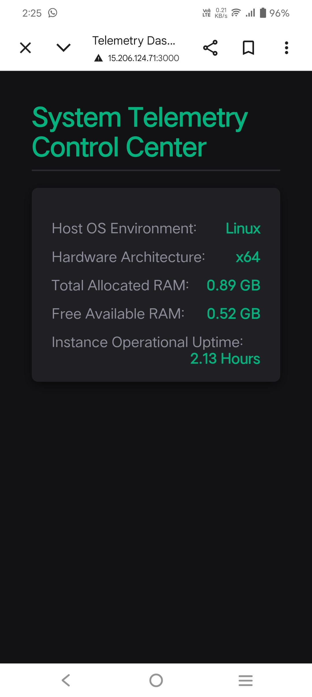

# Live Cloud System Telemetry Dashboard

A full-stack cloud monitoring application that extracts live Linux kernel telemetry from an AWS EC2 instance and displays infrastructure metrics through a responsive web dashboard.

---

## Dashboard Preview



---

## Project Overview

This project demonstrates end-to-end cloud infrastructure monitoring by collecting real-time Linux system metrics and serving them through a Node.js backend to a dynamic web dashboard.

The application is deployed on an AWS EC2 instance and continuously monitors host-level performance indicators.

---

## Features

### Infrastructure Monitoring

* Linux Operating System Detection
* Hardware Architecture Detection
* RAM Utilization Monitoring
* Free Memory Tracking
* System Uptime Monitoring

### Planned Enhancements

* CPU Usage Monitoring
* CPU Load Average
* Disk Usage Metrics
* Disk I/O Statistics
* Network Throughput Monitoring
* Running Process Metrics
* Hardware Temperature Monitoring
* Historical Metric Storage
* Alerting System
* Authentication & Authorization

---

## Architecture Flow

Linux Host Machine

↓

Node.js Telemetry Service

↓

Express REST API

↓

Frontend Dashboard

↓

AWS EC2 Deployment

---

## Tech Stack

### Frontend

* HTML5
* CSS3
* JavaScript
* Fetch API

### Backend

* Node.js
* Express.js
* Native OS Module

### Cloud & DevOps

* AWS EC2
* Ubuntu Linux
* SSH Authentication (.pem)
* Git Version Control
* Security Groups

---

## Live Metrics Collected

| Metric         | Description        |
| -------------- | ------------------ |
| OS Environment | Linux Distribution |
| Architecture   | x64 / ARM          |
| Total RAM      | Installed Memory   |
| Free RAM       | Available Memory   |
| Uptime         | Instance Runtime   |

---

## Deployment

The application is deployed on an AWS EC2 instance.

### Security Configuration

* SSH Key Authentication
* Security Group Rules
* Restricted Port Access

### Open Ports

| Port | Purpose   |
| ---- | --------- |
| 22   | SSH       |
| 3000 | Dashboard |

---

## Local Installation

Clone repository

```bash
git clone https://github.com/rathansai-dev/my-telemetry-dash.git
```

Navigate to project

```bash
cd my-telemetry-dash
```

Install dependencies

```bash
npm install
```

Start server

```bash
npm start
```

Open browser

```text
http://localhost:3000
```

GitHub:
https://github.com/rathansai-dev

